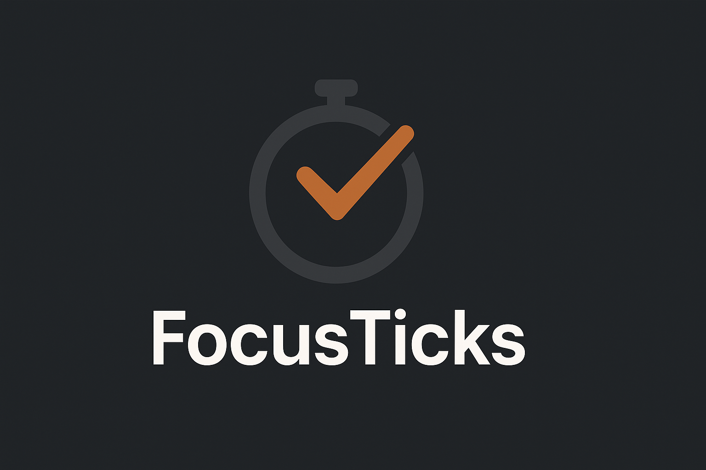
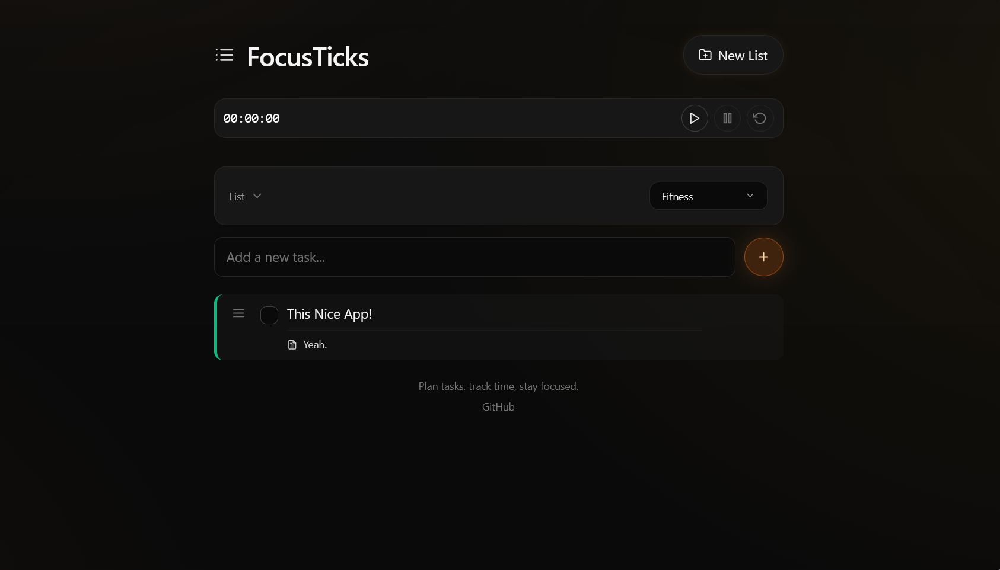

<p align="center">
  <!-- Replace the src below with your actual logo path -->
  <a href="https://ozny35.github.io/FocusTicks/" target="_blank" rel="noopener">
    
  </a>
</p>

<h1 align="center">FocusTicks</h1>
<p align="center">
  Plan tasks, track time, stay focused.
</p>

<p align="center">
  <a href="https://ozny35.github.io/FocusTicks/">Live Demo</a> •
  <a href="#features">Features</a> •
  <a href="#quickstart">Quickstart</a> •
  <a href="#development">Development</a> •
  <a href="#deploy-to-github-pages">Deploy</a>
</p>

---

## Features
- Minimal to‑do lists with drag‑and‑drop reordering
- Stopwatch per list: start/stop/reset, elapsed time tracking
- Categories with emoji + color to organize lists
- Color customization for both lists and individual tasks
- Notes and due dates on tasks
- Smooth animations, responsive UI
- LocalStorage persistence
- Performance optimizations: debounced storage writes, memoized components, lazy‑loaded Emoji Picker
- Built with Vite, React, TypeScript, Tailwind, and Framer Motion

## Screenshots
 

## Tech Stack
- Vite + React + TypeScript
- Tailwind CSS
- Framer Motion
- emoji-picker-react

## Quickstart
```bash
# 1) Install deps
npm install

# 2) Run dev server
npm run dev

# 3) Open
Open localhost on your browser
